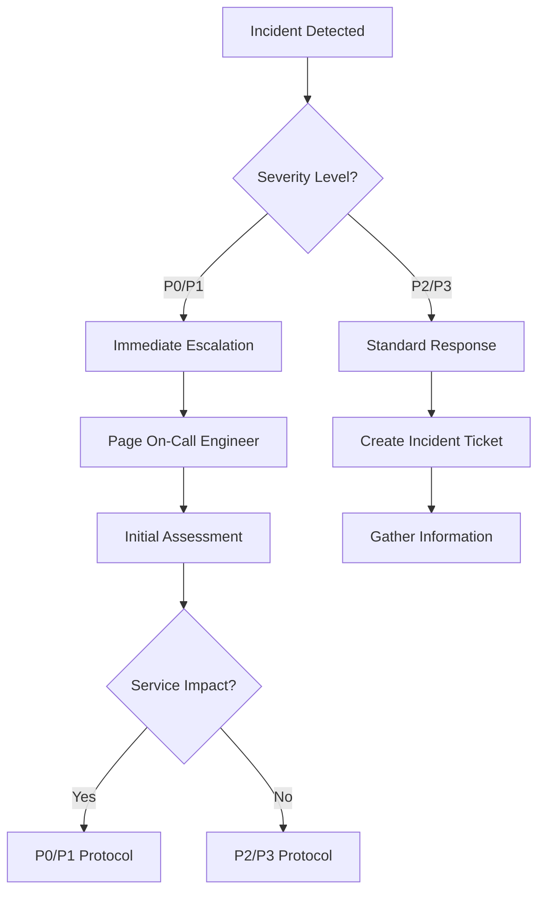

# =============================================================================
# Disaster Map - Incident Response Procedures
# Version: 1.0 | Last Updated: September 20, 2026
# =============================================================================

## Table of Contents

- [Incident Classification](#incident-classification)
- [Response Workflow](#response-workflow)
- [Communication Protocol](#communication-protocol)
- [Runbooks by Incident Type](#runbooks-by-incident-type)
- [Post-Incident Review](#post-incident-review)

---

## Incident Classification

### Severity Levels

| Level | Name | Impact | Response Time | Example |
|-------|------|--------|---------------|---------|
| **P0** | Critical | Complete service outage, data loss risk | < 5 min | All SLAM tracking failed, database down |
| **P1** | High | Major functionality impaired | < 15 min | FPS < 20 for extended period |
| **P2** | Medium | Partial degradation | < 30 min | Intermittent connection drops |
| **P3** | Low | Minor issues, non-critical | < 4 hours | High latency on specific endpoint |

### Severity Criteria

#### P0 - Critical
- Complete service unavailability
- Data corruption or loss risk
- Security breach detected
- Regulatory compliance violation
- Customer-facing API completely down

#### P1 - High
- Core functionality severely degraded
- Performance below acceptable thresholds (FPS < 25)
- Multiple systems affected
- Significant customer impact

#### P2 - Medium
- Single system degradation
- Intermittent issues affecting some users
- Non-core functionality impaired
- Elevated error rates (> 10%)

#### P3 - Low
- Minor performance issues
- Cosmetic problems
- Isolated incidents with quick resolution
- Feature requests or enhancements

---

## Response Workflow

### Phase 1: Detection & Triage (0-5 minutes)



**Detection Sources:**
- Automated monitoring alerts (Prometheus/Grafana)
- User reports via support channels
- Error rate spikes in logs
- Performance degradation metrics
- Third-party monitoring systems

**Triage Checklist:**
- [ ] Verify incident is real (not false positive)
- [ ] Determine affected users/systems
- [ ] Assess business impact
- [ ] Classify severity level
- [ ] Assign incident owner
- [ ] Notify stakeholders per communication protocol

---

### Phase 2: Initial Response (5-15 minutes)

#### P0/P1 Incident Actions

```bash
# 1. Acknowledge and assess
echo "Incident acknowledged at $(date)" | tee /var/log/incident.log

# 2. Check current status
kubectl get pods -l app=disaster-map-backend -n production
curl http://prometheus:9090/api/v1/query?query=up{job="disaster-map-backend"}

# 3. Review recent changes
git log --oneline -10
kubectl rollout history deployment/disaster-map-backend -n production

# 4. Check error rates
curl 'http://prometheus:9090/api/v1/query?query=sum(rate(error_total[1m]))'
```

**Immediate Actions:**
- [ ] Page on-call engineer via PagerDuty/OpsGenie
- [ ] Create incident ticket in tracking system
- [ ] Set up war room (Slack channel, conference call)
- [ ] Notify stakeholders per communication protocol
- [ ] Begin root cause analysis if possible

#### P2/P3 Incident Actions

```bash
# 1. Document the issue
echo "Issue: $(date)" >> /var/log/incidents/p3.log

# 2. Check affected systems
kubectl get pods -l app=disaster-map-backend -n production --show-labels

# 3. Review recent deployments
git log --since="1 hour ago" --oneline

# 4. Monitor for escalation
watch -n 5 'curl http://prometheus:9090/api/v1/query?query=up'
```

**Actions:**
- [ ] Create incident ticket with full details
- [ ] Assign to appropriate team member
- [ ] Set up monitoring dashboard for tracking
- [ ] Document expected resolution time

---

### Phase 3: Resolution (15 minutes - several hours)

#### Common Resolution Strategies

| Strategy | When to Use | Expected Time |
|----------|-------------|---------------|
| **Rollback** | Recent bad deployment, known issue | < 5 min |
| **Traffic Diversion** | Partial outage, can route around | < 10 min |
| **Service Restart** | Hung processes, memory leaks | < 2 min |
| **Capacity Scaling** | Resource exhaustion under load | < 5 min |
| **Circuit Breaker** | Cascading failures | Immediate |

#### Rollback Procedure (P0/P1)

```bash
# Step 1: Identify previous working version
PREVIOUS_TAG=$(kubectl rollout history deployment/disaster-map-backend -n production \
  --output=jsonpath='{.items[-2].image}')

# Step 2: Execute rollback
kubectl rollout undo deployment/disaster-map-backend -n production

# Step 3: Verify rollback status
kubectl rollout status deployment/disaster-map-backend -n production --timeout=120s

# Step 4: Monitor metrics
watch -n 5 'curl http://prometheus:9090/api/v1/query?query=rate(frame_processed_total[1m])*60'
```

#### Capacity Scaling (P1/P2)

```bash
# Horizontal Pod Autoscaler adjustment
kubectl scale deployment/disaster-map-backend --replicas=6 -n production

# Or update HPA directly
kubectl set resources deployment/disaster-map-backend \
  --requests=cpu=500m,memory=512Mi \
  --limits=cpu=2000m,memory=2Gi \
  -n production

# Verify scaling
kubectl get hpa disaster-map-backend -n production
```

---

### Phase 4: Recovery Verification (Post-resolution)

**Verification Checklist:**
- [ ] All services running and healthy
- [ ] Error rates back to normal (< 5%)
- [ ] FPS ≥ 30 fps sustained for 5+ minutes
- [ ] Latency P95 < 200ms
- [ ] No new alerts in monitoring system
- [ ] User reports resolved

**Verification Commands:**
```bash
# Health check endpoints
curl -f http://disaster-map-backend:8000/health || echo "FAILED"

# Verify FPS metrics (should be ≥ 30)
curl 'http://prometheus:9090/api/v1/query?query=rate(frame_processed_total[1m])*60'

# Check error rates (should be < 5%)
curl 'http://prometheus:9090/api/v1/query?query=sum(rate(error_total[1m]))/sum(rate(request_total[1m]))*100'

# Verify latency P95 (should be < 200ms)
curl 'http://prometheus:9090/api/v1/query?query=histogram_quantile(0.95,rate(latency_seconds_bucket[1m]))'

# Check active streams
kubectl get pods -l app=disaster-map-backend -n production
```

---

### Phase 5: Post-Incident Review (Within 24 hours)

**Review Meeting Agenda:**
1. Timeline of events (what happened, when)
2. Root cause analysis
3. Impact assessment (users affected, duration)
4. Response effectiveness
5. Lessons learned
6. Action items and owners

**Post-Incident Report Template:**

```markdown
# Incident Post-Mortem: [Incident ID]

## Summary
- **Date/Time**: [timestamp]
- **Severity**: P0/P1/P2/P3
- **Duration**: [start time] to [end time] = [total duration]
- **Impact**: [number of users affected, % of traffic]

## Timeline
| Time | Event | Responsible |
|------|-------|-------------|
| 10:00 | Incident detected | Monitoring Alert |
| 10:02 | On-call paged | PagerDuty |
| ... | ... | ... |

## Root Cause
[Detailed analysis of what caused the incident]

## Impact
- **Users Affected**: [number/percentage]
- **Data Loss**: Yes/No
- **Financial Impact**: [estimated cost]
- **Reputation Impact**: [assessment]

## Response Effectiveness
### What Went Well
- [ ] Rapid detection and escalation
- [ ] Effective communication
- [ ] Quick resolution strategy

### What Could Be Improved
- [ ] Earlier detection mechanisms
- [ ] Better monitoring coverage
- [ ] More comprehensive runbooks

## Action Items
| Item | Owner | Due Date | Status |
|------|-------|----------|--------|
| Fix root cause | [name] | [date] | Open |
| Update monitoring | [name] | [date] | Open |
| Improve documentation | [name] | [date] | Open |

## Follow-up
- Next review date: [date]
- Related tickets: [list of ticket numbers]
```

---

## Communication Protocol

### Stakeholders to Notify

| Role | Notification Method | Timing |
|------|---------------------|--------|
| On-call Engineer | PagerDuty/OpsGenie page | Immediate |
| Team Lead | Slack DM + Phone | Within 5 min |
| Product Owner | Email + Slack | Within 10 min (P0/P1) |
| Engineering Manager | Email + Slack | Within 15 min (P0/P1) |
| Customers | Status page email | After resolution (P0/P1) |

### Communication Channels

```yaml
# Primary channels for incident communication
slack:
  - channel: #disaster-map-incidents
    purpose: Real-time incident discussion
  - channel: #disaster-map-war-room
    purpose: Dedicated war room during incidents

pagerduty:
  service_key: disaster-map-backend
  escalation_policy: engineering-oncall

status_page:
  url: https://status.disaster-map.io
  update_frequency: Every 15 min during P0/P1 incidents
```

### Status Page Updates

**P0/P1 Incident Template:**
```markdown
## [Incident ID] - Service Degradation

**Status**: Investigating / Identified / Mitigating / Resolved  
**Started**: [timestamp]  
**Impact**: SLAM tracking performance degraded for all users  

**Current Status**: We are investigating reports of reduced FPS in the disaster map visualization. Our engineering team is actively working on this issue.

**Expected Resolution**: Unknown at this time. We will provide updates every 15 minutes.
```

---

## Runbooks by Incident Type

### SLAM Tracking Failure (P0)

**Symptoms:**
- FPS drops to near zero
- No pose updates in visualization
- Complete tracking loss

**Immediate Actions:**
```bash
# 1. Check if backend is responding
curl http://disaster-map-backend:8000/health

# 2. Verify SLAM metrics
curl 'http://prometheus:9090/api/v1/query?query=rate(frame_processed_total[1m])*60'

# 3. Check for memory issues
docker stats disaster-map-backend --no-stream

# 4. Restart if necessary
kubectl rollout restart deployment/disaster-map-backend -n production
```

**Root Causes:**
- Memory exhaustion causing OOM kills
- Database connection pool exhausted
- Redis cache completely missed
- CPU throttling from cloud provider

---

### High Error Rate (P1)

**Symptoms:**
- HTTP 5xx errors > 10%
- Slow response times
- Intermittent failures

**Immediate Actions:**
```bash
# 1. Identify error source
curl 'http://prometheus:9090/api/v1/query?query=sum(rate(http_requests_total{status=~"5.."}[1m]))'

# 2. Check specific endpoints
curl 'http://prometheus:9090/api/v1/query?query=rate(http_requests_total{endpoint="/api/track",status=~"5.."}[1m])'

# 3. Review recent deployments
git log --since="1 hour ago" --oneline

# 4. Scale up if under load
kubectl scale deployment/disaster-map-backend --replicas=6 -n production
```

---

### Database Connection Issues (P0/P1)

**Symptoms:**
- "Too many connections" errors
- Slow queries timing out
- Complete database unavailability

**Immediate Actions:**
```bash
# 1. Check connection pool status
psql -c "SELECT count(*) FROM pg_stat_activity WHERE datname = 'disaster_map'"

# 2. Identify slow queries
psql -c "SELECT now(), query, state, wait_event_type FROM pg_stat_activity WHERE query_start < NOW() - INTERVAL '1 minute' ORDER BY wait_time DESC LIMIT 10"

# 3. Kill problematic connections (if necessary)
psql -c "SELECT pg_terminate_backend(pid) FROM pg_stat_activity WHERE pid <> pg_backend_pid() AND state = 'idle in transaction'"

# 4. Restart database if needed
kubectl rollout restart deployment/postgres -n production
```

---

### Network/Connectivity Issues (P1/P2)

**Symptoms:**
- RTSP stream disconnections
- High latency between services
- Intermittent timeouts

**Immediate Actions:**
```bash
# 1. Check network connectivity
ping -c 5 <backend_service>
traceroute <stream_source_ip>

# 2. Monitor packet loss
mtr -n --report <backend_service>

# 3. Check firewall rules
iptables -L -v -n | grep ESTABLISHED

# 4. Verify DNS resolution
nslookup <service_name>
```

---

## Post-Incident Review

### Timing

| Action | Timeframe | Owner |
|--------|-----------|-------|
| Initial post-mortem draft | Within 2 hours of resolution | Incident Commander |
| Stakeholder review meeting | Within 4 hours | Team Lead |
| Final post-mortem document | Within 24 hours | Engineering Manager |
| Action items tracking | Ongoing until complete | Product Owner |

### Lessons Learned Categories

1. **Detection**: Could we have detected this earlier?
2. **Response**: Was our response timely and effective?
3. **Communication**: Were stakeholders informed appropriately?
4. **Prevention**: How can we prevent recurrence?
5. **Process**: What improvements to our processes are needed?

### Action Item Tracking

| Priority | Action Item | Owner | Due Date | Status | Verified |
|----------|-------------|-------|----------|--------|----------|
| P0 | [ ] Fix root cause | [name] | [date] | Open | - |
| P1 | [ ] Update monitoring alerts | [name] | [date] | In Progress | - |
| P2 | [ ] Improve documentation | [name] | [date] | Open | - |

---

## Related Documentation

- [Deployment Runbook](./deployment.md)
- [Troubleshooting Guide](../troubleshooting/common-issues.md)
- [Disaster Recovery Plan](./disaster-recovery.md)
- [Monitoring Dashboard Setup](../monitoring/README.md)
